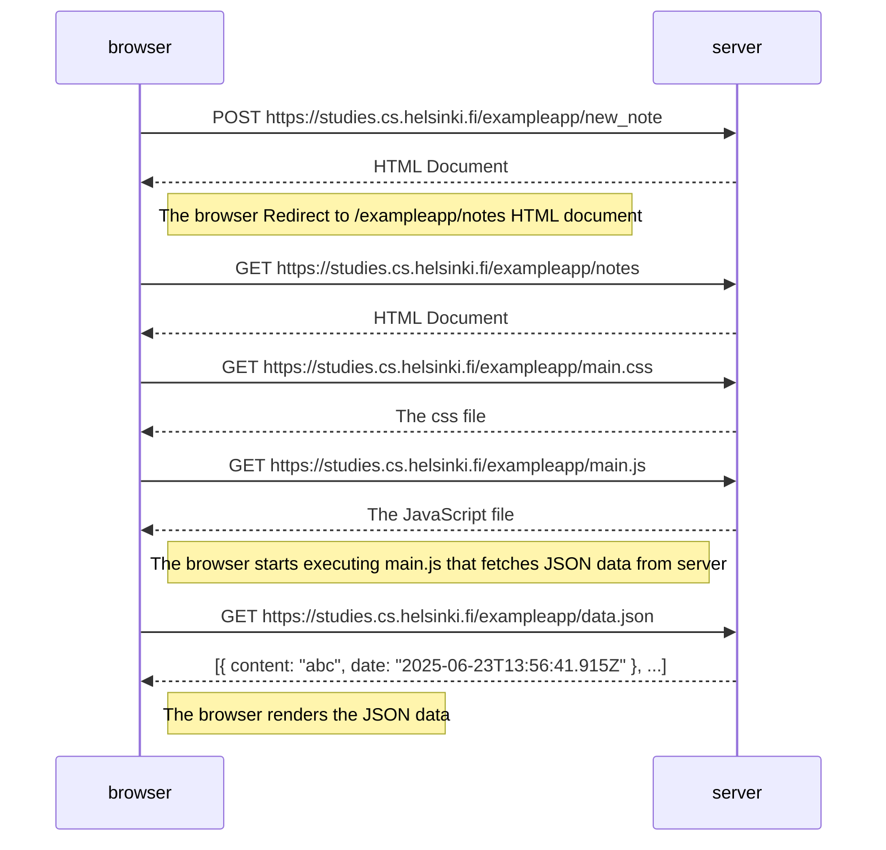

```mermaid
sequenceDiagram
  participant browser as browser
  participant server as server

  browser ->> server: POST https://studies.cs.helsinki.fi/exampleapp/new_note
  server -->> browser: HTML Document
  Note right of browser: The browser Redirect to /exampleapp/notes HTML document

  browser ->> server: GET https://studies.cs.helsinki.fi/exampleapp/notes
  server -->> browser: HTML Document

  browser ->> server: GET https://studies.cs.helsinki.fi/exampleapp/main.css
  server -->> browser: The css file

  browser ->> server: GET https://studies.cs.helsinki.fi/exampleapp/main.js
  server -->> browser: The JavaScript file
  Note right of browser: The browser starts executing main.js that fetches JSON data from server

  browser ->> server: GET https://studies.cs.helsinki.fi/exampleapp/data.json
  server -->> browser: [{ content: "abc", date: "2025-06-23T13:56:41.915Z" }, ...]
  Note right of browser: The browser renders the JSON data


```
