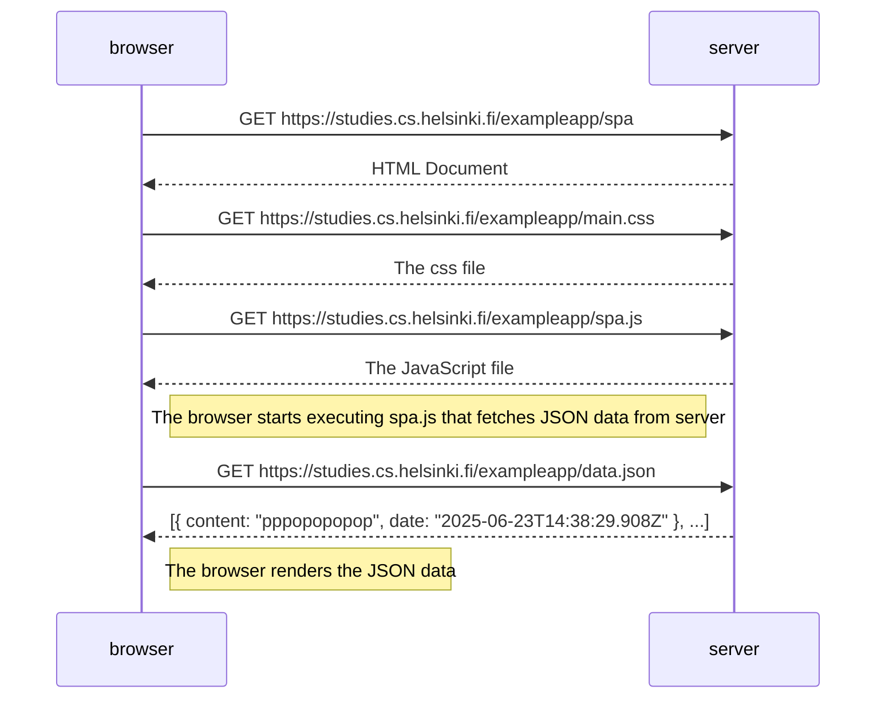

```mermaid
sequenceDiagram
  participant browser as browser
  participant server as server

  browser ->> server: GET https://studies.cs.helsinki.fi/exampleapp/spa
  server -->> browser: HTML Document

  browser ->> server: GET https://studies.cs.helsinki.fi/exampleapp/main.css
  server -->> browser: The css file

  browser ->> server: GET https://studies.cs.helsinki.fi/exampleapp/spa.js
  server -->> browser: The JavaScript file
  Note right of browser: The browser starts executing spa.js that fetches JSON data from server

  browser ->> server: GET https://studies.cs.helsinki.fi/exampleapp/data.json
  server -->> browser: [{ content: "pppopopopop", date: "2025-06-23T14:38:29.908Z" }, ...]
  Note right of browser: The browser renders the JSON data

```
